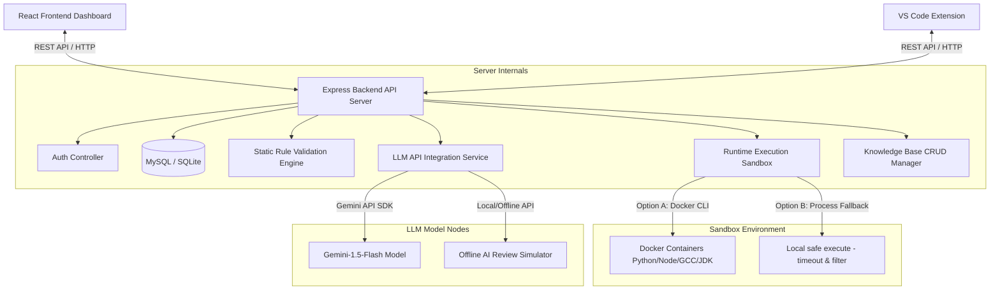
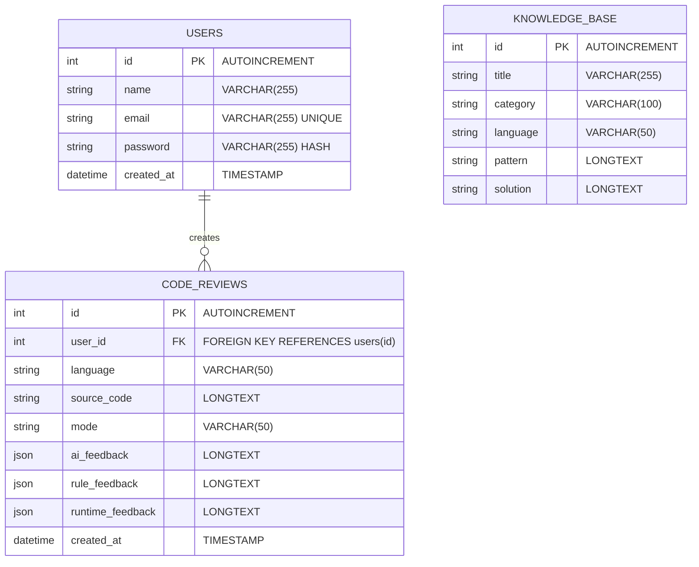

# Project Diagrams: AI-Based Code Review System

This document outlines the System Architecture, Use Cases, and Entity-Relationship model for the application.

---

## 1. System Architecture Diagram

This diagram displays the integration of the React client, IDE extension, REST API routing, compilation engine, and LLM providers.



---

## 2. Use Case Diagram

This diagram describes interactions between developers, student users, the backend server, and the Gemini model.

```mermaid
leftToRightDirection
actor Developer
actor Student
actor "Gemini AI Model" as AIModel

rectangle "AI-Based Code Review System" {
    usecase "Register / Authenticate Account" as UC1
    usecase "Submit Code for Review" as UC2
    usecase "Inspect Static Rules Violations" as UC3
    usecase "Execute Code in Sandbox Console" as UC4
    usecase "Request AI Feedback & Grade" as UC5
    usecase "View Big-O Complexity Metrics" as UC6
    usecase "View Basic Learning Tutorials" as UC7
    usecase "Search Programming Knowledge Base" as UC8
    usecase "Contribute Custom Rule Entries" as UC9
    usecase "View Performance Analytics Chart" as UC10
    usecase "Trigger Review inside VS Code IDE" as UC11
}

Developer --> UC1
Developer --> UC2
Developer --> UC3
Developer --> UC4
Developer --> UC5
Developer --> UC6
Developer --> UC8
Developer --> UC9
Developer --> UC10
Developer --> UC11

Student --> UC7
Student --> UC2

UC5 ..> AIModel : Invokes API
UC6 ..> AIModel : Invokes API
```

---

## 3. ER Diagram (Entity-Relationship)

This diagram details database fields and foreign key mappings between user sessions, submissions history, and rules tables.


