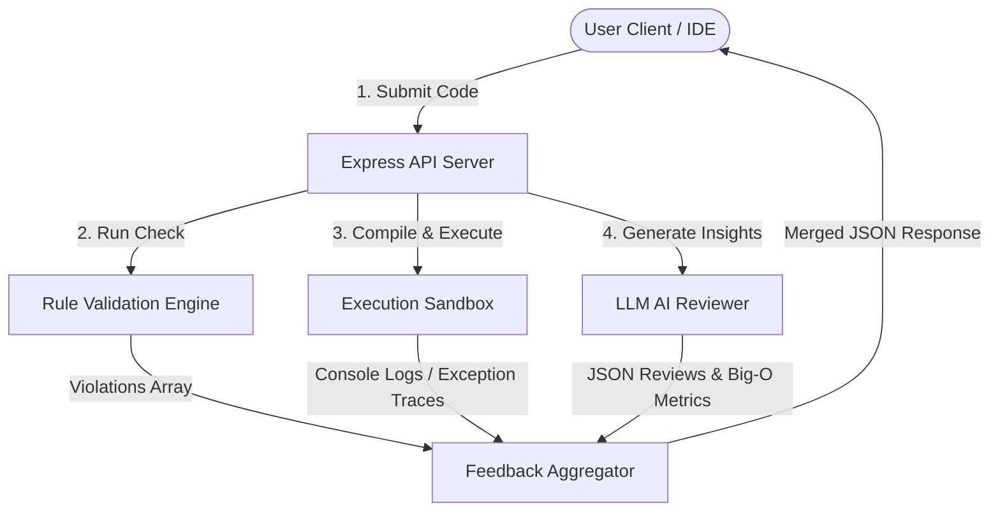
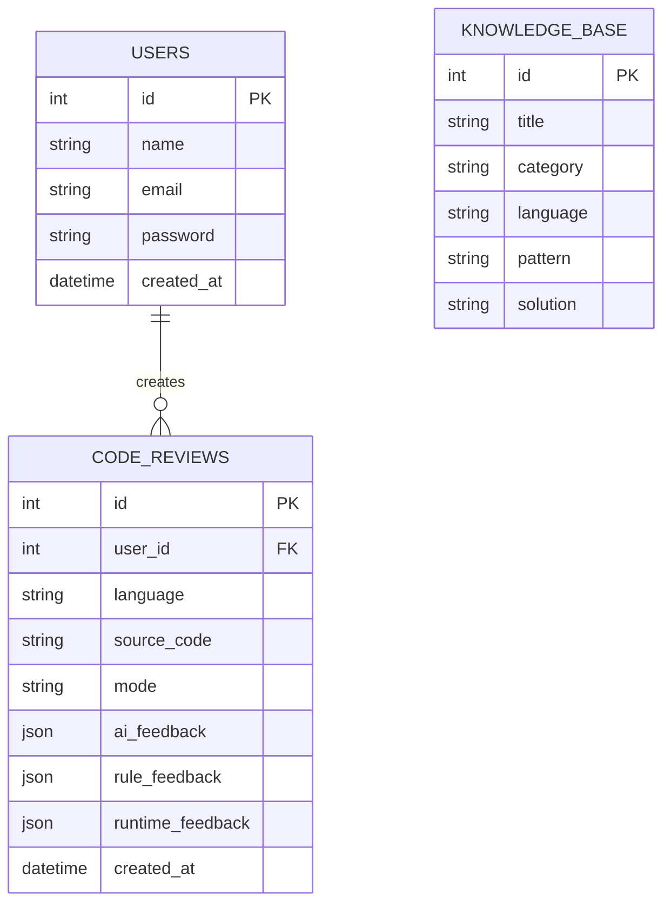

# Project Report: AI-Based Code Review System Using Large Language Models with Hybrid Validation and IDE Integration

---

## 1. Abstract

Modern software development requires continuous inspection for logical bugs, performance bottlenecks, runtime exception risks, and security issues. While traditional static code analysis (linters) checks syntax guidelines, it struggles with complex logical code flaws. Conversely, generative Large Language Models (LLMs) excel at reasoning but are prone to hallucinating compilation or runtime success. 

This paper introduces a hybrid validation architecture combining rule-based engines, Docker-based code execution sandboxing, and LLM diagnostics. We present **ReviewLLM**, a platform offering a React-based interactive web workspace (Monaco Editor), a secure runtime execution sandbox, a collaborative coding knowledge base, and a dedicated VS Code extension that renders diagnostic reports directly inside the developer's IDE.

---

## 2. Problem Statement & Objectives

### 2.1 Problem Statement
Developers spend approximately 30-40% of their working time reviewing, refactoring, and debugging source code. Common developer mistakes include:
- Unused variables that pollute memory.
- Unbounded loops leading to CPU freezes.
- Heap-allocated pointer structures causing memory leaks.
- Dangerous I/O and parse statements omitting exception safeguards.
- Hardcoded secrets and configuration values (API keys, passwords).

Existing tools are either pure static checkers that lack semantic reasoning, or LLMs that review code but fail to test if the code compiles or executes correctly.

### 2.2 Project Objectives
Our objective is to design a unified code validation pipeline that:
1. Parses Javascript, Python, C++, and Java files through static validation rules.
2. Compiles and executes code inside isolated runtime sandboxes (Docker/local isolated processes) to capture stderr tracebacks.
3. Queries an LLM (Gemini API) to generate code quality grades, refactoring snippets, and time/space Big-O complexity reports.
4. Feeds learning tips/tutorials to students (Student Mode) and targets OWASP security/performance fixes for engineers (Developer Mode).
5. Exposes these insights inline within the VS Code editor using wavy highlights and hovers.

---

## 3. System Design & Modeling

### 3.1 Database Modeling (Entity Relationship Diagram)
The database structure persists user registrations, historical submissions, and common coding patterns to improve recommendations.

---

## 4. Implementation Details

### 4.1 Hybrid Rule Engine
Static checking is written using regular expression matchers tailored to each target language:
- **Variable usage analysis**: Tracks variable declarations (e.g. `let`, `var`, `const` in Javascript or assignment structures in Python) and compares total occurrences. If an identifier is only seen once, it is marked as `unused_variable`.
- **Memory leaks**: Tracks balanced `new` and `delete` operators in C++ source text.
- **Naming standards**: Validates variables against `camelCase` for JavaScript/TypeScript, and `snake_case` for Python.

### 4.2 Isolated Sandbox Runner
To prevent dangerous operations from affecting the backend host, the runtime sandbox utilizes a dual execution model:
1. **Docker Container Sandbox**: Mounts a localized directory containing the code and executes standard images (`node:slim`, `python:slim`, `gcc`, `openjdk`) with constrained resources:
   - `--memory=128m` (RAM limitation)
   - `--cpus=0.5` (CPU cycle limit)
   - `--network=none` (Blocked socket/network connections)
2. **Local Protected Process (Fallback)**: Spawns sub-processes with a **2-second timeout** to kill infinite loops. A keyword filter scans code prior to run for unauthorized modules (`child_process`, `import os`, `system(`, `Runtime.getRuntime()`) and blocks execution on security policy violations.

### 4.3 LLM Review Prompt Engineering
Prompts request structured JSON content directly from Gemini API (`gemini-1.5-flash`), eliminating parsing errors. 
- **Student Mode Prompt**: Limits explanations to high-level conceptual teaching, lists step-by-step tutorials, and adds external learning links.
- **Developer Mode Prompt**: Instructs the model to perform security checks (OWASP Top 10), performance adjustments, and Big-O computational calculations.

---

## 5. Results & Discussion

- **Static analysis rules** are highly reliable and run instantaneously, showing naming violations and unused fields in under 5 milliseconds.
- **Sandbox execution** successfully stops infinite loops (returning a strict timeout warning) and maps runtime exception traces back to line numbers.
- **AI reviews** provide high-level semantic feedback. By combining these three inputs, developers receive immediate alerts that cover all levels of verification.

---

## 6. Conclusion & Future Scope

The hybrid code review platform effectively bridges the gap between rule-based analyzers and reasoning models. Future improvements include:
1. Expanding language support to Rust, Go, and Ruby.
2. Integrating AST (Abstract Syntax Tree) parsing libraries in the static rule engine for better scoping checks.
3. Incorporating team-wide collaboration features in the dashboard, like pull request integration (GitHub Actions) for automatic reviews.
